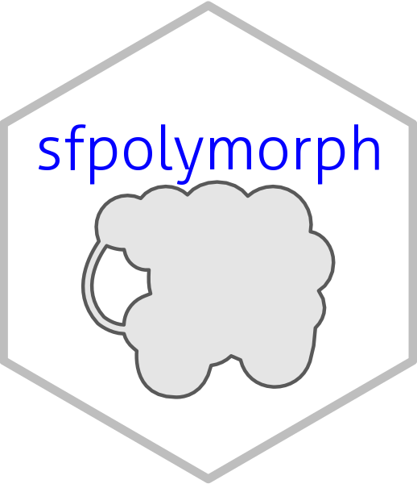

---
output:
  md_document:
    variant: markdown_github
---

<!-- README.md is generated from README.Rmd. Please edit that file -->

```{r, echo = FALSE}
knitr::opts_chunk$set(
  collapse = TRUE,
  comment = "#>",
  fig.path = "README-"
)
```

# sfpolymorph

```{r echo=FALSE, out.width="10%"}

```

[](https://www.tidyverse.org/lifecycle/#experimental)

The goal of sfpolymorph is to create an add-on for the `sf` package to quantify various aspects of polygon shape.

## Roadmap

* Build off the work in https://github.com/USEPA/lakemorpho but use the sf package.

* Incorporate additional metrics from http://clear.uconn.edu/tools/Shape_Metrics/
